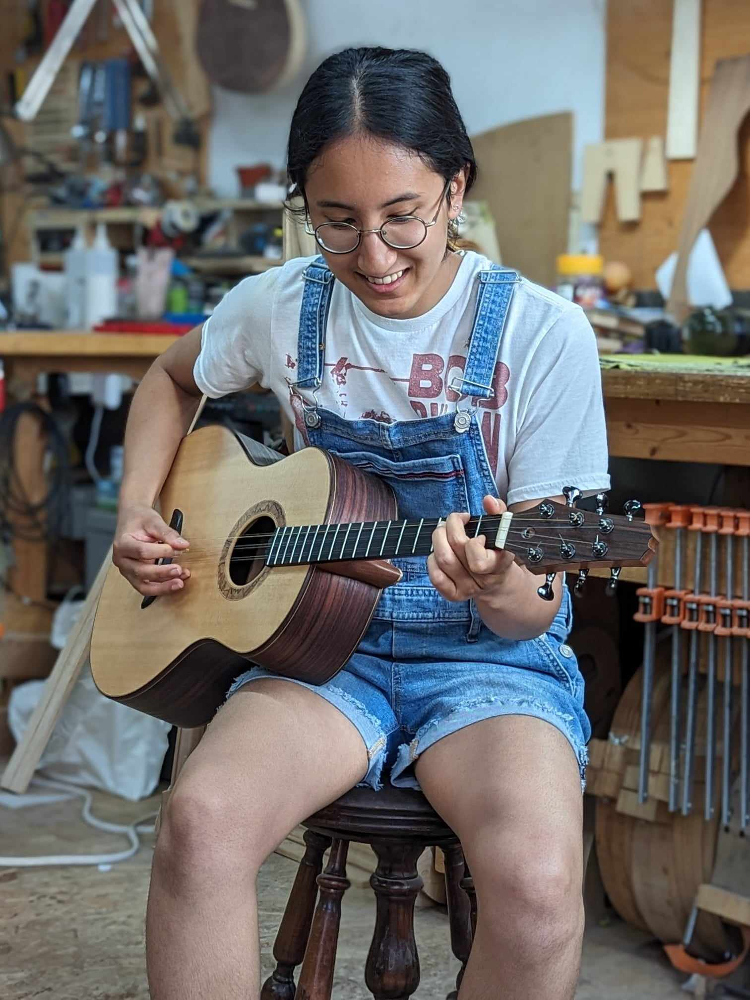

## About

<blockquote>

"Within every creative person there is an inventor at odds with a museum curator."

- Glenn Gould

</blockquote>

My name is May Shukla and I run Ursa Instruments.

I believe the most important difference between buying factory-made products and buying products from a smaller shop is the personal connection you get to have with the maker.
So to start, I'll tell you my story.

My journey to becoming an instrument maker was far from direct.
Before I worked wood I programmed computers.
I have degree in Computer Engineering from the University of Alberta and I have worked for a couple of big tech companies.
What I loved about computer engineering was the power it gave me to create things.
I loved the challenge of breaking down a big system into smaller parts and then translating those parts to code.
I think breaking down systems is what engineering is all about.
However, I wished that I could work with my hands and also do something that would satisfy my love for music.

When I moved to Montreal, I stumbled upon the Mile End Guitar Co-op by accident.
When I walked into the shop I knew immediately that this was a place where I wanted to be.
Machines, guitars, the smell of coffee - it was so exciting!
Luthier Michael Kennedy of the co-op offered to teach me about instrument making by building a tres - a small guitar-like instrument from Cuba.
Through this learning experience, I discovered that making instruments gave me the same mental satisfaction that programming did.
However, it scratched that itch to do something musical.

From there I decided to build my own instruments and I chose the banjo to start.
I love old-time country music and I go to jam sessions regularly here in Montreal.
It seemed like the perfect instrument to build in this context.

Through my banjos and other instruments I want to convey a respect for tradition as well as a forward-thinking mindset.
As <a href="https://youtu.be/RPDBcdDGrnE?si=o_c5s1As816jdXFs&t=281" target="_blank">Glenn Gould said</a> "Within every creative person there is an inventor at odds with a museum curator."
For example, I borrow design elements from instruments and decorative movements of the past.
However, I am always trying new methods of construction in order to make the banjo play better, sound better, and last longer!

In the future I'd like to design other kinds of instruments (guitars? mandolins? Indian instruments?).
I'd also like to continue to develop my skills as a woodworker and especially in decorative carving.

That's the story so far.

\- May